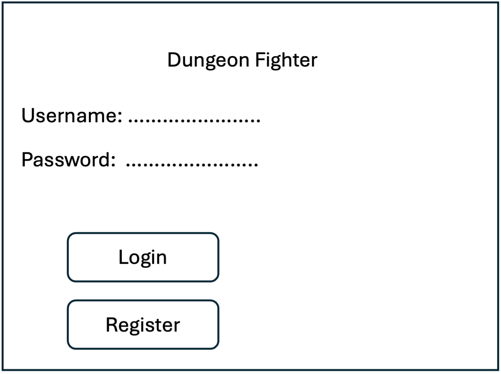
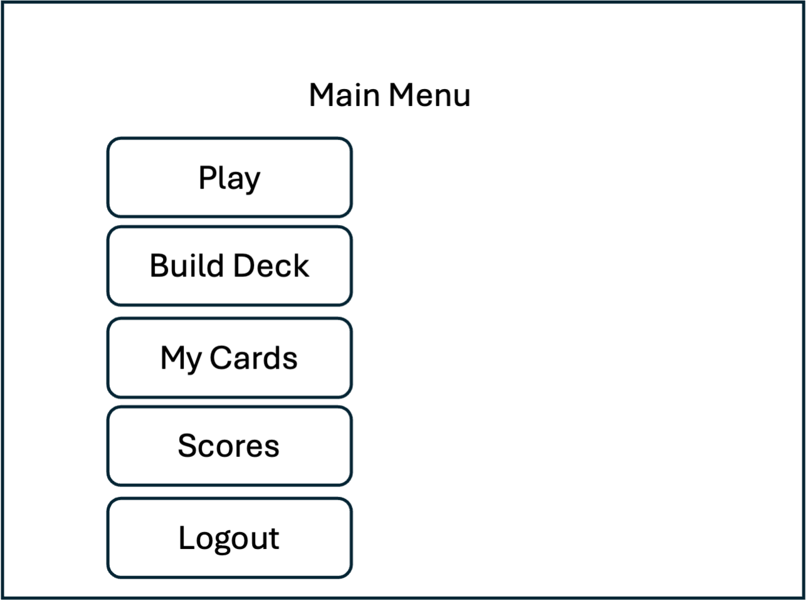
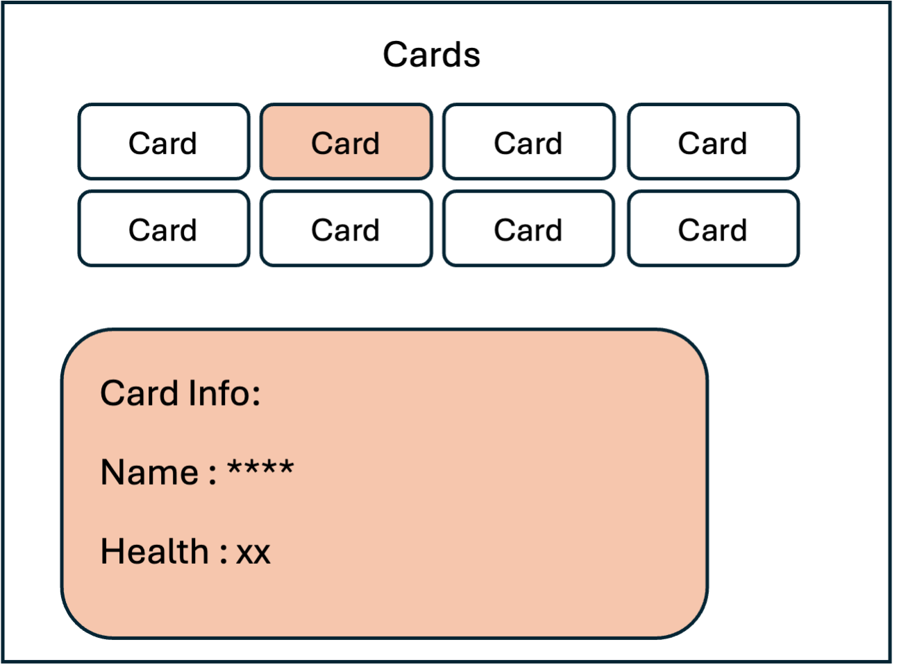
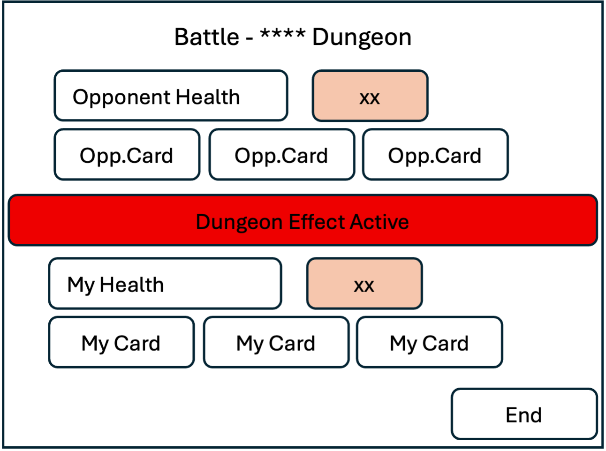

## Project Description: 
**Dungeon arena**, is a card-based game where players collect, manage, and battle using a limited set of unique cards. Each user can store a predetermined amount of cards. These cards will have unique properties such as a running health bar, and abilities. Players compete in a variety of arenas, each having its own visual theme and gameplay effects. Each card will have a unique design, and the amount of arenas and cards will be limited. 

## Mockups

### Login Screen

### dungeonfighter.Main Menu

### Cards

### Battle

